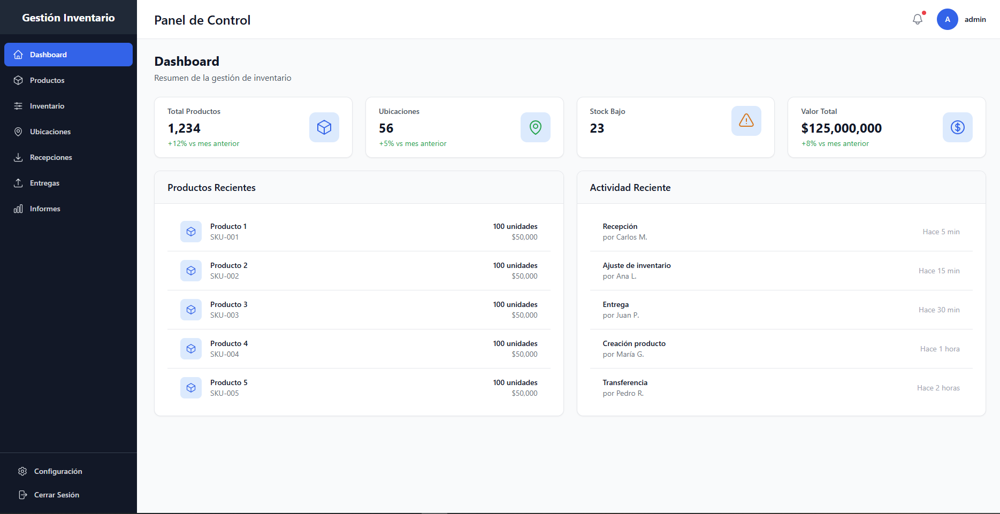
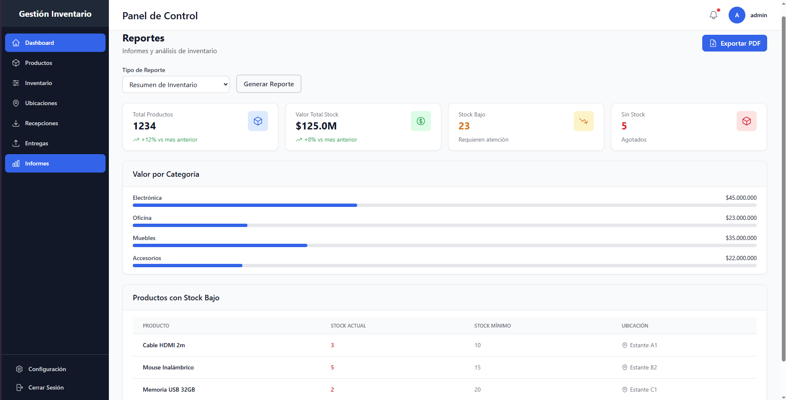
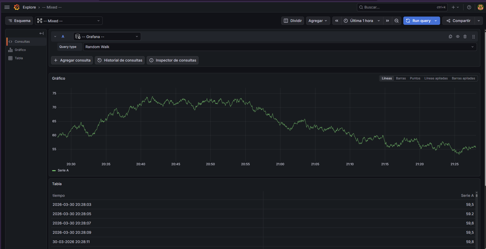

# Sistema de Gestión de Inventario Avanzado

<!-- I1: Badges -->
[](https://github.com/Gitluhub/gestion-inventario/actions/workflows/ci.yml)
[](https://github.com/Gitluhub/gestion-inventario/actions)
[](https://www.odoo.com)
[](LICENSE)
[](docker-compose.yml)
[](api_gateway_service/)
[](frontend/)

Sistema de gestión de inventario empresarial construido sobre Odoo 16.0 LTS, con pipeline ETL, API Gateway JWT y dashboard en Next.js. Diseñado para cumplir estándares de producción: observabilidad estructurada, seguridad por capas y CI/CD automatizado.

**🌐 Demo en vivo:** [https://odoo-inventario.duckdns.org](https://odoo-inventario.duckdns.org) — usuario: `admin` / contraseña: `admin`

---

## Capturas de Pantalla

<!-- I2: Screenshots section -->
> Las capturas de pantalla están disponibles en [`docs/screenshots/`](docs/screenshots/).

| Dashboard de Inventario | Ajustes de Stock | Grafana Metrics |
|-------------------------|------------------|-----------------|
|  |  |  |

---

## Arquitectura

```
┌──────────────────────────────────────────────────────┐
│                      Cliente                         │
└────────────────────────┬─────────────────────────────┘
                         │ HTTPS
                         ▼
               ┌─────────────────┐
               │   Nginx (TLS)   │  Reverse proxy + terminación SSL
               └────────┬────────┘
              ┌─────────┴─────────┐
              ▼                   ▼
    ┌──────────────┐    ┌──────────────────┐
    │  Frontend    │    │   API Gateway    │  JWT, rate limiting, circuit breaker
    │  (Next.js)   │    │   (FastAPI)      │
    └──────────────┘    └────────┬─────────┘
                                 │
                     ┌───────────┴────────────┐
                     ▼                        ▼
            ┌──────────────┐        ┌──────────────────┐
            │  Odoo 16.0   │        │   ETL Service    │  CSV / API / BD → Odoo
            │ + inventory  │        │   (Python)       │
            │   _custom    │        └──────────────────┘
            └──────┬───────┘
                   │
                   ▼
          ┌──────────────────┐
          │  PostgreSQL 15   │  Backup automático diario
          └──────────────────┘

Observabilidad: Prometheus → Grafana / Loki ← Promtail
```

### Stack Tecnológico

| Capa | Tecnología | Versión |
|------|-----------|---------|
| ERP | Odoo + módulo `inventory_custom` | 16.0 LTS |
| Base de datos | PostgreSQL | 15 |
| API Backend | FastAPI + Pydantic v2 | 0.100+ |
| Frontend | Next.js 14 App Router + Tailwind | 14 |
| ETL | Python + tenacity + schedule | 3.11 |
| Proxy | Nginx (TLS 1.2/1.3, HSTS) | stable-alpine |
| Métricas | Prometheus + Grafana | latest |
| Logs | Loki + Promtail | 2.9.0 |
| Orquestación | Docker Compose | 2.20+ |
| CI/CD | GitHub Actions | — |

---

## Decisiones Técnicas

<!-- I3: Sección de decisiones técnicas -->

### 1. Módulo Odoo personalizado en lugar de una BD independiente

**Decisión:** Extender `stock` de Odoo en lugar de crear una BD propia para el inventario.

**Razón:** Odoo ya incluye un motor de stock probado (movimientos, trazabilidad, multi-almacén). Reimplementarlo desde cero habría creado deuda sin valor. El módulo `inventory_custom` añade solo lo que Odoo no trae: clasificación avanzada de ubicaciones, ajustes con flujo de aprobación y alertas de stock mínimo.

**Trade-off:** Acoplamiento a la versión de Odoo (16.0). Mitigado usando `_inherit` en lugar de `_name`, de modo que los upgrades de Odoo solo requieren revisar los campos extendidos.

---

### 2. API Gateway FastAPI frente a exponer Odoo directamente

**Decisión:** Un microservicio FastAPI como proxy entre el frontend y Odoo.

**Razón:**
- Odoo XML-RPC no soporta JWT nativo ni rate limiting.
- Desacopla el contrato de API del ciclo de versiones de Odoo.
- Permite añadir middlewares (observabilidad, CORS, circuit breaker) sin tocar el ERP.

**Trade-off:** Un hop adicional en latencia (~5 ms). Aceptable para un dashboard interno.

---

### 3. Refresh token en cookie httpOnly (no en localStorage)

**Decisión:** El refresh token (7 días) viaja solo en `Set-Cookie: httpOnly; Secure; SameSite=Strict`. El access token (30 min) se guarda en memoria / cookie JS.

**Razón:** Un token en `localStorage` es accesible desde cualquier script, lo que lo hace vulnerable a XSS. Con `httpOnly` el token es opaco al JavaScript: el navegador lo envía automáticamente sin que ningún código lo pueda leer.

**Trade-off:** Requiere `credentials: 'include'` en el fetch del frontend y configuración CORS con `allow_credentials=True`.

---

### 4. ETL como cron dentro de Docker, no como Celery

**Decisión:** El ETL corre con `schedule` + cron de Alpine cada 15 minutos.

**Razón:** El volumen de datos no justifica la complejidad operacional de Celery (Redis broker, workers, flower). Un cron simple es predecible, visible en logs y fácil de depurar.

**Trade-off:** Sin reintentos distribuidos. Mitigado con `tenacity` (retry exponencial) dentro del propio proceso ETL.

---

### 5. Logging JSON estructurado desde el primer commit

**Decisión:** Todos los servicios emiten logs como líneas JSON con `timestamp`, `level`, `request_id`, y campos de contexto.

**Razón:** Los logs de texto libre son imposibles de consultar en Loki/Grafana. Con JSON, cualquier campo es un label filtrable sin parsers adicionales.

**Trade-off:** Ligero overhead de serialización (<0.1 ms por log). Irrelevante frente a la ganancia en observabilidad.

---

## Módulo Odoo: `inventory_custom`

El módulo extiende Odoo 16 con:

| Funcionalidad | Modelo |
|---------------|--------|
| Marcas de productos | `product.brand` |
| Niveles de stock mínimo/máximo + alertas | `product.template` (extendido) |
| Ubicaciones avanzadas (tipo, capacidad, clase) | `stock.location` (extendido) |
| Ajustes de inventario con aprobación | `stock.inventory.adjustment` |
| Wizard de ajuste rápido | `stock.inventory.wizard` |
| Informes: stock, movimientos, alertas, histórico | vistas/acciones reutilizando modelos Odoo |


---

## Inicio Rápido

### Requisitos

- Docker Engine 24.0+
- Docker Compose 2.20+
- 8 GB RAM mínimo (16 GB recomendado para producción)

### 1. Clonar y configurar

```bash
git clone https://github.com/GitLuhub/Gestion-inventario.git
cd Gestion-inventario
cp .env.example .env
```

### 2. Generar secretos

```bash
bash secrets/setup_secrets.sh
```

### 3. Iniciar servicios

```bash
# Stack base (Odoo + PostgreSQL + ETL + API + Frontend + Nginx)
docker compose up -d --build

# Con observabilidad (Prometheus + Grafana + Loki + Promtail)
docker compose --profile monitoring up -d --build

# Con backup automático (producción)
docker compose --profile production up -d --build
```

### 4. Cargar datos de demo

```bash
# Crea productos, ubicaciones y ajustes de ejemplo para demostración
bash scripts/seed_demo.sh
```

### 5. Acceder

| Servicio | URL local | URL producción |
|----------|-----------|----------------|
| Frontend | http://localhost:3000 | https://odoo-inventario.duckdns.org |
| Odoo | http://localhost:8069 | https://odoo-inventario.duckdns.org/web |
| API Swagger | http://localhost:8000/docs | https://odoo-inventario.duckdns.org/api/docs |
| Grafana | http://localhost:3001 | http://34.68.166.29:3001 |
| Prometheus | http://localhost:9090 | http://34.68.166.29:9090 |

Credenciales demo: `admin` / `admin`

---

## Comandos de Desarrollo

```bash
# Reconstruir un servicio
docker compose up -d --build odoo_app

# Ver logs en tiempo real
docker compose logs -f api_gateway

# Ejecutar tests del módulo Odoo
docker exec inventory_odoo_app /usr/bin/odoo \
  -c /etc/odoo/odoo.conf -d odoo_db \
  --test-enable --stop-after-init --no-xmlrpc --workers=0 \
  --test-tags /inventory_custom

# Tests de rendimiento
docker exec inventory_odoo_app /usr/bin/odoo \
  -c /etc/odoo/odoo.conf -d odoo_db \
  --test-tags /inventory_custom:TestCRUDPerformance \
  --stop-after-init --no-xmlrpc --workers=0

# Tests API Gateway
cd api_gateway_service && pytest tests/ -v --cov=src --cov-report=term

# Tests Frontend
cd frontend && npm test -- --coverage

# Acceder a PostgreSQL
docker exec -it inventory_pg_db psql -U odoo -d odoo_db

# Linting XML del módulo (sin Odoo)
cd odoo_custom_module && python tests/validate_views.py
```

---

## API Gateway — Endpoints Principales

```bash
# Login (devuelve access token; refresh token en cookie httpOnly)
curl -X POST http://localhost:8000/api/v1/auth/login \
  -H "Content-Type: application/x-www-form-urlencoded" \
  -d "username=admin&password=admin" -c cookies.txt

# Listar productos
curl http://localhost:8000/api/v1/products \
  -H "Authorization: Bearer <access_token>"

# Inventario actual
curl http://localhost:8000/api/v1/inventory \
  -H "Authorization: Bearer <access_token>"

# Ajustar stock
curl -X POST http://localhost:8000/api/v1/inventory/adjust \
  -H "Authorization: Bearer <access_token>" \
  -H "Content-Type: application/json" \
  -d '{"product_id": 1, "location_id": 5, "new_qty": 100}'

# Refrescar token (usa cookie httpOnly automáticamente)
curl -X POST http://localhost:8000/api/v1/auth/refresh -b cookies.txt
```

Documentación interactiva completa en http://localhost:8000/docs.

---

## Monitoreo

### Métricas Prometheus

El API Gateway expone `/metrics` con:
- `api_gateway_requests_total` — contador por método, endpoint y status
- `api_gateway_request_duration_seconds` — histograma de latencia

### Grafana

Dashboards preconfigurados en `docker/grafana/dashboards/`:
- **Infrastructure Overview** — CPU, memoria, red por contenedor
- **Odoo Performance** — requests/s, workers activos, errores
- **ETL Pipeline** — registros procesados, errores, duración
- **PostgreSQL Stats** — conexiones, cache hit ratio, tamaño de BD

### Logs

Con el perfil `monitoring`, Promtail recoge los logs de todos los contenedores y los envía a Loki. Consultables desde Grafana → Explore → Loki.

---

## CI/CD

### CI Pipeline (`.github/workflows/ci.yml`)

Ejecuta en cada push y PR:
1. Linting (flake8, mypy, ESLint)
2. Tests unitarios con cobertura ≥ 80%
3. Build de imágenes Docker

### CD Pipeline (`.github/workflows/cd.yml`)

- `main` → deploy a producción vía SSH (manual en la VM actual)

Para habilitar el deploy automático, configurar en GitHub → Settings → Actions → Secrets:
```
GCP_HOST          # IP pública de la VM
GCP_USER          # usuario SSH
GCP_SSH_KEY       # clave privada SSH (sin passphrase)
```

---

## Backup y Recuperación

El servicio `pg_backup` (perfil `production`) ejecuta `pg_dump` diariamente a las 2:00 AM y retiene 7 días de backups en `./backups/`.

```bash
# Restaurar un backup
gunzip -c backups/odoo_db_20260330_020000.sql.gz | \
  docker exec -i inventory_pg_db psql -U odoo odoo_db
```

**RTO objetivo:** < 1 hora | **RPO objetivo:** < 24 horas

---

## Licencia

Este proyecto se distribuye bajo la licencia [LGPL-3.0](LICENSE) para el módulo Odoo (herencia de la licencia de Odoo), y MIT para los demás componentes.
